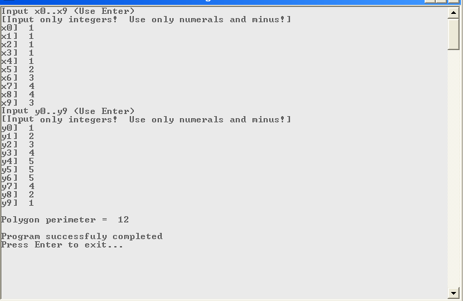
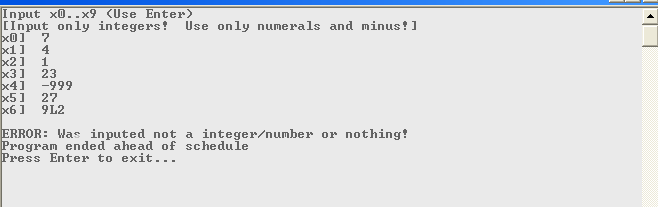

# Летняя практика. 4-ый семестр

## Задача

Даны целые числа x1, y1, x2, y2, ..., x10, y10. Найти периметр десятиугольника, вершины которого имеют соответственно координаты (x1, y1), (x2, y2), ..., (x10, y10).

## [Ссылка на код программы](https://github.com/NemoNology/ComputerArchitecture/blob/main/Summer%20practice/MY/My%20summer%20practice/Porgram/SP%20Program.ASM)

## Примеры работы программы

